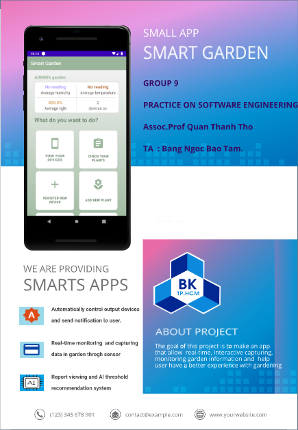

# Smart Garden App
An IOT garden control project implement with Android Studio. This is a school project in Ho Chi Minh University of Technology

## Brief information
The main repo for this project is this [link](https://github.com/ZoroZero/Group9-Smart-garden-project).
In this repo, we add some other stuffs like report, video demo.

